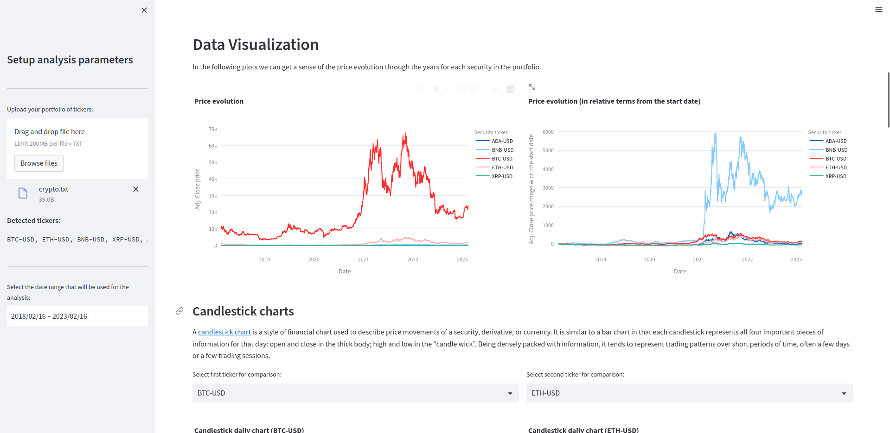

<div id="top"></div>

<!-- PROJECT LOGO -->
<br />
<div align="center">
  

  <h1 align="center">StockPicker</h1>
  <h4 align="center">A web app for tracking performance of financial securities</h4>

</div>

<!-- TABLE OF CONTENTS -->
<details>
  <summary>Table of Contents</summary>
  <ol>
    <li>
      <a href="#about-the-project">About The Project</a>
      <ul>
        <li><a href="#execution-plan">Execution Plan</a></li>
        <li><a href="#data">Data</a></li>
        <li><a href="#challenges-and-improvements">Challenges and improvements</a></li>
      </ul>
    </li>
    <li>
      <a href="#getting-started">Getting Started</a>
      <ul>
        <li><a href="#setting-up-a-conda-environment">Setting up a conda environment</a></li>
        <li><a href="#file-descriptions">File descriptions</a></li>
        <li><a href="#usage">Usage</a></li>
      </ul>
    </li>
    <li><a href="#additional-notes">Additional Notes</a></li>
    <li><a href="#license">License</a></li>
    <li><a href="#contact">Contact</a></li>
    <li><a href="#acknowledgments">Acknowledgments</a></li>
  </ol>
</details>

---
## About The Project

It is often not straight-forward to discern which stocks have performed better than others when looking at historical data. Stock's price changes constantly, with some events, such as economic recessions, pandemics or natural disasters heavily affecting the valuations of many companies.

However, these companies are not necessarily affected the same way, and their publicly traded price can, due to a multitude of factors, react very differently to the same events. For example, in 2020 there was the COVID-19 outbreak, eCommerce companies such as Amazon, as well as hardware manufacturers such as NVIDIA, saw a dramatic increase in the demand of their products due to the pandemic's lockdowns. We will be able to see this clearly in the data later on.

As small investors, we might be interested in analysing the past performance of a certain portfolio of companies, as well as be able forecast whether they will continue their present trend.

The goal of this project is to provide an easy to use interface to quickly compare the performance of multiple companies over a given period of time by means of visualizations and aggregated statistics. This will allow users to pick which companies did best. It will also provide an idea of how the stocks will change their price in the near future. We aim to answer questions such as:

1. Which company grew more in value?
2. Which company experimented the lowest volatility? Which experimented the highest?
3. Which company is expected to grow more in value?

However, it is important to consider that, according to [random walk theory](https://en.wikipedia.org/wiki/Random_walk_hypothesis), market prices behave randomly and not as a function of their time series. In other words, the patterns observed in the historical price a certain financial security are unlikely to help predict the future. In financial markets, we find that the future value of a security depends on its previous value plus some unexplained variance.

**DISCLAIMER:** This project is merely meant to be used for understanding the past and get a sense of the future. **The insights gained and any recommendations made with StockPicker do not encompass financial advise**. The value of a company at any given time and its evolution dependes on many factors that aren't taken into account in this project. Real-world value investing requires an in-depth analysis of each company and sector, and it's still not guaranteed to yield better returns than simply investing in a market index. And above all, **Past performance is no guarantee of future results. Don't assume an investment will continue to do well in the future simply because it's done well in the past.**

<p align="right">(<a href="#top">back to top</a>)</p>

### Data

This project uses financial data extracted from [Yahoo Finance](https://finance.yahoo.com) through its API. For each set of security tickers in an input portfolio, the following data is downloaded:

- **Tickers information**: Contains multiple information fields of each ticker, such as company name, description and some financial metrics such as revenue.
- **Tickers daily data**: Daily price data price values (open, close, min, high) for each ticker for the user-provided data range.

<p align="right">(<a href="#top">back to top</a>)</p>

### Execution Plan

The main notebook of this project, located in `notebooks/main.ipynb`, follows along the CRISP-DM data science process to analyse the tickers in a pre-defined portfolio made up of several *big tech* companies. The following steps are taken:

  1. **Business Understanding.** Figuring out what questions we want to answer from this data.
  2. **Data Exploration.** Downloading financial data using the Python package [yfinance](https://pypi.org/project/yfinance/) and exploring it.
  3. **Data Preparation.** Extracting insights from the data via statistics and visualizations.
  4. **Data Modeling.** Building a forecasting model to evaluate price predictions.

However, the main output of this project is a web app developed with [streamlit](https://streamlit.io/). This can be used to process any user-provided portfolio of tickers by following the same steps detailed above.

### Challenges and improvements

While analysing past financial data can be extremely helpful to understand what has happened, the patterns observed in the past rarely repeat in the future. The underwhelming results of the forecasting models developed in this project are a witness to that.

While developing a good forecasting model was not the main goal of this project, it is worth mentioning how it might be improved in the future. According to [financial theory](https://en.wikipedia.org/wiki/Random_walk_hypothesis), price follows a seemingly random beahaviour and can thus not be predicted. In reality, the factors impacting the price of a security are so complex and unexpected, that they seem random. It is therefore imperative to use relevant external information to make reasonable predictions on how the price of a particular security might evolve with time. This might include insights from a fundamental analysis of each company as well as sentiment analysis on social media. The possibilities are endless.

<p align="right">(<a href="#top">back to top</a>)</p>

---

## Getting Started

To make use of this project, I recommend managing the required dependencies with Anaconda.

### Setting up a conda environment

Install miniconda:

```bash
wget https://repo.anaconda.com/miniconda/Miniconda3-latest-Linux-x86_64.sh
bash Miniconda3-latest-Linux-x86_64.sh
```

Install mamba:

```bash
conda install -n base -c conda-forge mamba
```

Install environment using provided file:

```bash
mamba env create -f environment.yml
mamba activate stock_picker
```

### Usage

#### Main Notebook

Follow along the main notebook (`notebooks/main.ipynb`) to analyse the financial data of the main big tech companies.

#### Web App 

To start the web app, run the following command:

```bash
streamlit run app/main.py
```

Go to the URL indicated by streamlit and start using the data app! Just upload your portfolio of tickers (a text file with one ticker ID per line). It includes all the same steps as in the notebook:

**Data Download**


**Data Visualization**



**Data Forecasting**


### File descriptions

The project files are structured as follows:

- `data/portfolios`: A list of example portfolio files.
- `data/big_tech` and `data/crypto`: Example downloaded date for the **big_tech** and **crypto** portfolios, respectively.
- `notebooks/main.ipynb`: The main notebook of this project, which analyses the **big_tech** portfolio. A utility Jupyter notebook to examine results.
- `src/data`: Contains the source code for data processing.
- `src/models`: Contains the source code for data modeling.
- `app/main.py`: Contains the source code for the web app.

<p align="right">(<a href="#top">back to top</a>)</p>

---

## Additional Notes

Source files formatted using the following commands:

```bash
isort .
autoflake -r --in-place --remove-unused-variable --remove-all-unused-imports --ignore-init-module-imports .
black .
```

## License

Distributed under the MIT License. See `LICENSE` for more information.

## Contact

[Carlos Uziel Pérez Malla](https://www.carlosuziel-pm.dev/)

[GitHub](https://github.com/CarlosUziel) - [Google Scholar](https://scholar.google.es/citations?user=tEz_OeIAAAAJ&hl=es&oi=ao) - [LinkedIn](https://at.linkedin.com/in/carlos-uziel-p%C3%A9rez-malla-323aa5124) - [Twitter](https://twitter.com/perez_malla)

## Acknowledgments

This project was done as part of the [Data Science Nanodegree Program at Udacity](https://www.udacity.com/course/data-scientist-nanodegree--nd025).

The documentation of the [skforecast](https://pypi.org/project/skforecast/0.3.0/) Python package was fundamental in learning how to analyse and forecat financial data.

<p align="right">(<a href="#top">back to top</a>)</p>
